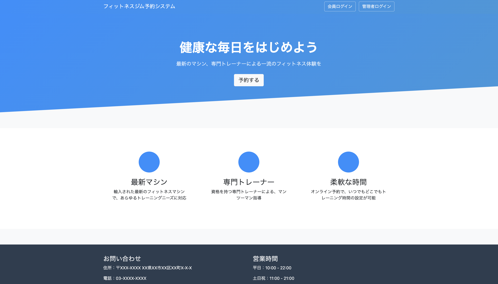

# ジム管理システム – Fitness Management System

## 📌 プロジェクト概要
このシステムは、Java Web を使用して開発された **ジム管理システム** です。
会員・トレーナー・管理者の情報を一元管理し、シフト管理や予約機能を通じて、ジム運営の効率化を目指します。

### **特徴：**
- 軽量な設計のため、フレームワークを使用せず、独自の **Dispatcher パターン** を開発
- **バックエンド：** Java Servlet & JDBC（リクエスト処理・データベース接続）
- **フロントエンド：** JSP + FullCalendar（カレンダーコンポーネント）

---

## 🌟 機能一覧
### **会員側**
- **会員登録・ログイン：** ジムの公式ページから会員登録・ログインが可能
- **予約機能：** コースや時間を基準にトレーナーを選択し、オンライン予約が可能。予約可能・不可の時間帯を色分け表示
- **予約履歴の確認：** 過去の予約履歴を一覧で確認可能

### **管理者・トレーナー側**
- **情報管理：** 管理者・トレーナー・会員の情報を登録・編集・削除可能
- **シフト管理：** 管理者がシフトを設定し、カレンダーに追加可能
- **トレーナーのシフト申請：** トレーナーは自身のシフトを追加可能
- **シフトの可視化：** 管理者がトレーナーのシフトを確認し、確定・未確定の状態を管理
- **コース管理：** コースの新規作成、編集、削除、およびカテゴリー管理に加え、進行管理も可能

---

## 🛠 使用技術
### **バックエンド**
| 技術 | 役割 |
|------|------|
| Java Servlet | HTTP リクエスト処理、コントローラー |
| JDBC | データベース接続・クエリ実行 |
| FastJSON | JSON データのシリアライズ・デシリアライズ |
| Dispatcher パターン | 各リクエストを適切な処理に振り分ける |

### **フロントエンド**
| 技術 | 役割 |
|------|------|
| JSP | 動的 HTML ページのレンダリング |
| Bootstrap | レスポンシブデザイン・UI スタイリング |
| jQuery | DOM 操作、AJAX を使った非同期通信 |
| FullCalendar | スケジュール表示用カレンダーコンポーネント |

### **開発環境**
| 環境 | バージョン |
|------|------|
| Java | 9 以上 |
| サーバー | Apache Tomcat 10 以上 |
| データベース | MySQL 5.7 以上 |
| 開発ツール | IntelliJ IDEA / Eclipse |

---

## 📷 スクリーンショット

以下はシステムのスクリーンショットです：

### **会員側の予約画面**

### **予約履歴の確認**

### **シフト管理画面**

### **コース管理画面**

### **トレーナー情報管理**

---

